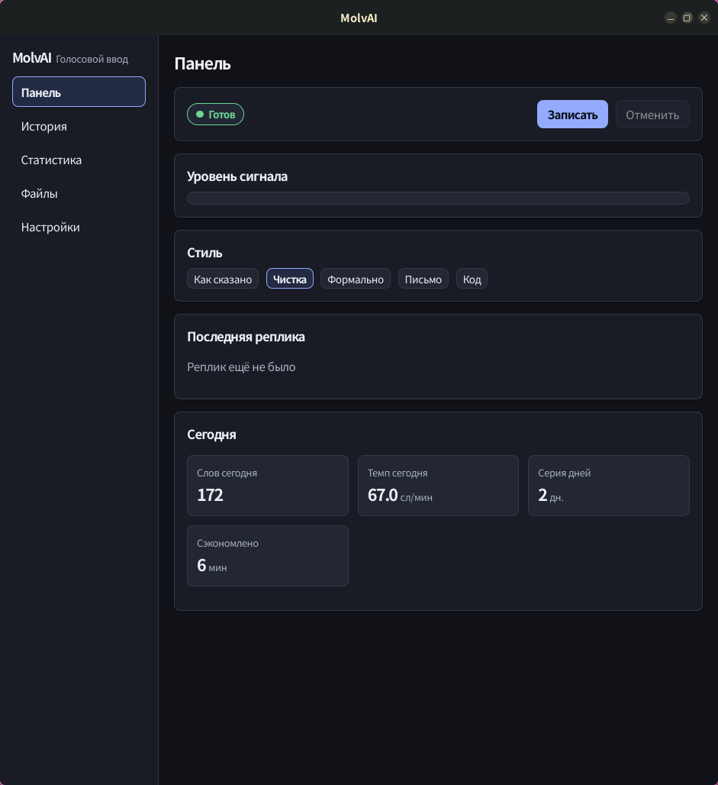
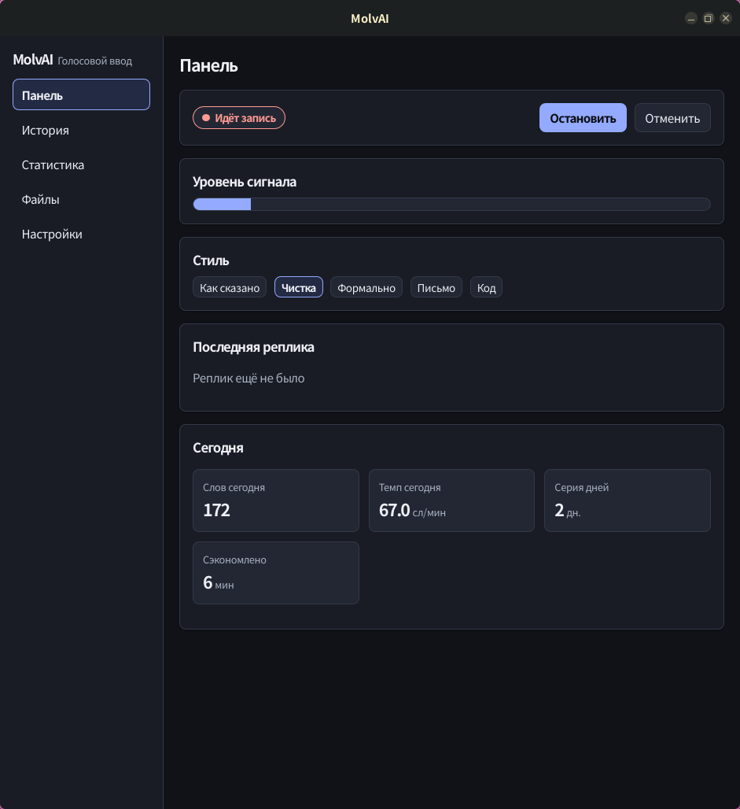
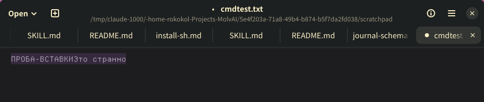
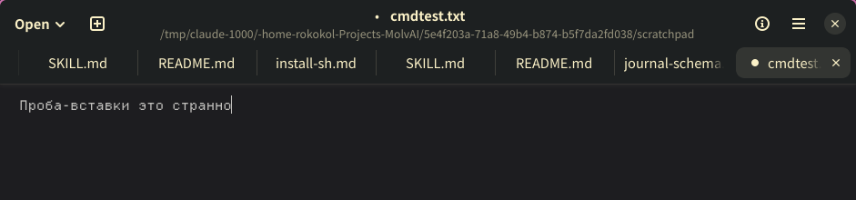

# MolvAI

[](https://github.com/rokokol/MolvAI/actions/workflows/ci.yml)
[](https://github.com/rokokol/MolvAI/actions/workflows/deny.yml)
[](LICENSE)

Открытый системный голосовой ввод: зажал клавишу, молвил, отпустил — текст появился в активном поле любого приложения. Обработка на вашем компьютере, одинаково на Linux, Windows и macOS

> [!NOTE]
> Проект создаётся на хакатоне V0ICE (Казань, 5–6 сентября 2026) и находится в разработке. Что уже работает, а что отрезано — в [docs/STATUS.md](docs/STATUS.md); разделы README заполняются по мере появления функций

## Как это работает

- **Захват** — микрофон через `cpal`, поток открывается только на время записи, звук приводится к моно 16 кГц
- **Распознавание** — `whisper.cpp` локально (CPU, CUDA, Vulkan или Metal), движок заменяется настройкой
- **Постобработка** — словарь терминов и правила без модели; при желании языковая модель через любой OpenAI-совместимый API, Ollama по умолчанию
- **Вставка** — эмуляция клавиатуры или вставка через буфер обмена с его восстановлением; способ выбирается автоматически и фиксируется в журнале

Подробнее — [docs/ARCHITECTURE.md](docs/ARCHITECTURE.md), схема журнала реплик — [docs/journal-schema.md](docs/journal-schema.md)

## Как это выглядит

| Панель в покое | Идёт запись |
| --- | --- |
|  |  |

Панель показывает состояние демона, живой уровень сигнала, выбор стиля обработки, последнюю реплику с темпом и статистику за сегодня; вкладки "История" и "Статистика" читают тот же JSONL-журнал, что и `molva history` и `molva stats`

## Установка

Самый короткий путь — попросить ИИ-агента: откройте Claude Code в каталоге репозитория и молвите "прочитай docs/install.md и установи MolvAI". Агент определит вашу систему, композитор и звуковой сервер, поставит зависимости, скачает модель и настроит клавиши — [docs/install.md](docs/install.md) написан как промпт именно для этого

### Одной командой

```sh
nix run github:rokokol/MolvAI -- --help                          # с Nix: собрать и запустить, не клонируя
git clone https://github.com/rokokol/MolvAI && cd MolvAI && ./install.sh   # без Nix: бинарник в ~/.local/bin
```

Готовые сборки для Linux, Windows и macOS лежат на [странице релизов](https://github.com/rokokol/MolvAI/releases): архив CLI, AppImage, deb, dmg и установщик Windows, каждый с суммой SHA-256 в `sha256sums.txt`

### С Nix

```sh
nix run github:rokokol/MolvAI -- --help   # собрать и запустить не клонируя
```

```sh
nix develop                        # тулчейн и системные библиотеки, ничего в систему не ставится
cargo build --release --bin molva
./install.sh                       # бинарник в ~/.local/bin, права администратора не нужны
```

### Без Nix

```sh
./install.sh --check   # что не хватает и какими командами это ставится в вашем дистрибутиве
```

Скрипт ничего не устанавливает сам: он печатает точные команды для Debian, Fedora, Arch, openSUSE, macOS и Windows, а решение принимает человек. Поставили — запустите `./install.sh` ещё раз

### Windows

Своего `install.ps1` пока нет, и заглушки вместо него тоже нет — честнее сказать прямо, чем положить в репозиторий скрипт, который ничего не делает. Собирайте `cargo build --release --bin molva` и кладите `target\release\molva.exe` куда удобно, либо возьмите готовый архив со страницы релизов; агент из [docs/install.md](docs/install.md) проводит через это по шагам

> [!WARNING]
> Пакеты GUI из релиза `v0.1.0` (`setup.exe`, `deb`, `AppImage`, `dmg`) кладут только окно, без CLI, поэтому при запуске демона окно просит собрать `molva`. Обход: распакуйте архив CLI для своей ОС из того же релиза и положите `molva` (`molva.exe`) рядом с приложением — на Windows обычно `%LOCALAPPDATA%\Programs\MolvAI\` — или в каталог из PATH, затем `molva models pull small`. Следующий релиз несёт CLI внутри пакетов

### Удаление

Снимается ровно то, что было установлено, по манифесту:

```sh
./install.sh --uninstall               # спросит про журнал реплик и настройки
./install.sh --uninstall --purge       # снести вместе с историей
./install.sh --uninstall --keep-history
```

## Быстрый старт

```sh
molva models pull small   # веса с Hugging Face, проверяются по SHA-256; без этого шага демон скачает их сам при первом старте
molva doctor                 # сессия, инструменты вставки, права, демон, веса whisper и sha256, провайдер модели
molva devices                # список микрофонов
molva test-inject            # проверить, что текст попадает в активное поле
molva daemon                 # демон, слушающий горячие клавиши
molva history paste --last   # вставить последнюю реплику заново, не диктуя её
```

Горячие клавиши в Hyprland — две строки в `~/.config/hypr/hyprland.conf`, где `bindr` срабатывает на отпускание:

```
bind  = , F9, exec, molva record start
bindr = , F9, exec, molva record stop
bind  = CTRL ALT, Z, exec, molva record toggle
bind  = CTRL ALT, X, exec, molva record toggle --mode command
bind  = CTRL ALT, C, exec, molva record cancel
```

Удержание и переключатель работают одновременно и на одних настройках: зажали `F9` — пишется, пока держите; коротко нажали её же — запись защёлкивается и идёт без клавиши до следующего нажатия; `Ctrl+Alt+Z` включает и выключает запись нажатием всегда

> [!NOTE]
> Сочетания по умолчанию выбраны неэргономичными сознательно: `F9` и `Ctrl+Alt` свободны почти в любой системе и приложении, поэтому на чужом стенде они срабатывают без настройки. Пока приложение в тестировании, это важнее удобства; под свою руку клавиши меняются в секции `[hotkeys]`

В GNOME и KDE те же две команды вешаются на пользовательскую комбинацию в настройках клавиатуры, на X11 без окружения годится `sxhkd`, а на Windows и macOS комбинацию регистрирует само приложение

## Приватность микрофона

Поток микрофона открывается в момент нажатия клавиши и закрывается сразу после отпускания: вне записи MolvAI не слушает ничего, а индикатор записи в системе погашен

Освобождение микрофона не зависит от того, чем закончилась реплика — поток закрывается и при отмене, и при ошибке, и при аварийном завершении демона, потому что `CpalSource::release_microphone` вызывается и из `stop`, и из `Drop`

Замер «от отпускания клавиши до закрытия потока» демон пишет в лог и в поле `latency_ms.stop_after_release` каждой записи журнала, так что гарантию можно проверить, а не принимать на слово

## Коды выхода

Скриптам и биндам композитора важен код, а не текст: `molva record start` в бинде не покажет пользователю сообщение, но код увидит скрипт

| Код | Что означает |
| --- | --- |
| `0` | всё получилось |
| `2` | неверные аргументы или неизвестное имя |
| `3` | демон не запущен или не отвечает |
| `4` | демон занят предыдущей репликой |
| `5` | ошибка движка распознавания |
| `6` | не удалось прочитать или записать файл |
| `7` | демон уже запущен: вторая копия завершилась с сообщением |

## Настройки

Файл `~/.config/molva/config.toml` (на Windows и macOS — соответствующий каталог настроек пользователя) создаётся при первом запуске и читается человеком. Пустой файл — валидный конфиг: любое пропущенное поле берётся из значений по умолчанию, поэтому в файле имеет смысл держать только то, что вы меняли

| Секция | Ключ | По умолчанию | Что делает |
| --- | --- | --- | --- |
| `audio` | `device` | `default` | микрофон из `molva devices` |
| `audio` | `gain` | `1.0` | усиление входного сигнала |
| `audio` | `max_duration_secs` | `600` | предел длины одной реплики |
| `audio` | `trim_silence` | `true` | обрезать тишину по краям записи |
| `audio` | `silence_threshold_db` | `-45.0` | порог, ниже которого сигнал считается тишиной |
| `audio` | `vad_min_pause_ms` | `1500` | пауза короче этой не режет реплику |
| `audio` | `noise_suppression` | `false` | шумоподавление |
| `audio` | `sounds` | `true` | звуковые метки начала и конца записи; `false` — полная тишина |
| `audio` | `sound_volume` | `0.4` | громкость этих сигналов, 0…1 |
| `audio` | `warn_zero_level` | `true` | предупреждать о нулевом уровне сигнала |
| `stt` | `engine` | `whisper-cpp` | `whisper-cpp` локально или `remote-openai` |
| `stt` | `model` | `small` | какие веса использовать |
| `stt` | `model_path` | пусто | путь к файлу весов; пусто — каталог моделей по умолчанию |
| `stt` | `language` | `ru` | код ISO-639-1 или `auto`; автоопределение на CPU в несколько раз медленнее |
| `stt` | `allowed_languages` | `["ru", "en"]` | среди каких языков выбирать при `auto` |
| `stt` | `threads` | `0` | потоков распознавания; `0` — все логические ядра |
| `stt` | `unload_after_secs` | `600` | через сколько выгрузить модель из памяти |
| `stt` | `no_speech_threshold` | `0.6` | порог, выше которого фрагмент считается не речью |
| `stt` | `auto_pull` | `true` | демон сам скачивает веса при старте, если их нет, с прогрессом в stderr и проверкой SHA-256; `false` — ошибка с командой `molva models pull` |
| `stt` | `chunked` | `true` | распознавать реплику кусками прямо во время записи |
| `stt` | `chunk_pause_ms` | `700` | пауза, по которой кусок уходит в модель |
| `stt` | `streaming_preview` | `true` | показывать черновик распознанного во время речи |
| `dictionary` | `path` | пусто | словарь терминов; пусто — `dictionary.toml` рядом с конфигом |
| `dictionary` | `fuzzy` | `true` | нечёткое сопоставление терминов |
| `dictionary` | `in_prompt` | `true` | передавать термины подсказкой в whisper |
| `rules` | `enabled` | `true` | постобработка правилами вообще |
| `rules` | `spoken_punctuation` | `true` | «запятая» голосом превращается в запятую |
| `rules` | `auto_punctuation` | `true` | расставлять пунктуацию самостоятельно |
| `rules` | `remove_fillers` | `true` | вычищать слова-паразиты |
| `rules` | `remove_repeats` | `true` | схлопывать повторы |
| `rules` | `numbers_as_digits` | `true` | числительные цифрами |
| `rules` | `llm_min_words` | `10` | реплики короче обрабатываются без языковой модели |
| `llm` | `enabled` | `false` | звать ли языковую модель вообще |
| `llm` | `provider` | `ollama` | `ollama`, `lmstudio`, `openrouter`, `groq`, `openai` или `custom` |
| `llm` | `base_url` | `http://localhost:11434/v1` | адрес OpenAI-совместимого API |
| `llm` | `model` | `qwen3.5:4b` | модель постобработки |
| `llm` | `api_key_env` | `OPENAI_API_KEY` | имя переменной окружения с ключом |
| `llm` | `api_key_source` | `keyring` | `keyring` — хранилище ОС (Secret Service на Linux, Credential Manager на Windows, Keychain на macOS), `file` — `secrets/llm-api-key-<provider>` рядом с настройками, `env` — только переменная окружения; в файле настроек ключа нет |
| `llm` | `timeout_secs` | `20` | сколько ждать ответа модели; дольше — текст уходит без неё |
| `llm` | `max_retries` | `2` | повторов запроса при сбое |
| `llm` | `reasoning_effort` | `auto` | `auto` шлёт локальным моделям `none`, облачным ничего; пустая строка — не слать; иначе значение как есть. Рассуждающие модели вроде qwen3.5 без этого тратят весь лимит токенов на размышления и отдают пустой текст |
| `style` | `default` | `cleanup` | стиль обработки текста по умолчанию |
| `style` | `by_app` | пусто | класс окна → свой стиль |
| `output` | `mode` | `auto` | `auto`, `paste`, `type` или `clipboard` |
| `output` | `auto_type_max_chars` | `200` | длиннее этого `auto` переключается на буфер обмена |
| `output` | `restore_clipboard` | `true` | вернуть прежнее содержимое буфера после вставки |
| `output` | `type_delay_ms` | `4` | задержка между символами при эмуляции ввода |
| `output` | `pre_inject_delay_ms` | `50` | пауза перед вставкой, чтобы фокус успел вернуться в поле ввода; на удалённом рабочем столе и в медленных приложениях ставят до `1500` |
| `output` | `terminal_shortcut` | `true` | в терминалах вставлять через Ctrl+Shift+V, определяя их по классу окна |
| `output` | `notify_on_fallback` | `true` | сообщать, когда способ вставки пришлось сменить |
| `hotkeys` | `backend` | `auto` | `auto`, `external`, `evdev` или `gui` |
| `hotkeys` | `push_to_talk` | `F9` | клавиша удержания; сочетания по умолчанию нарочно простые, чтобы работать на любом стенде |
| `hotkeys` | `toggle` | `Ctrl+Alt+Z` | включить и выключить запись нажатием |
| `hotkeys` | `command` | `Ctrl+Alt+X` | режим команд над выделением |
| `hotkeys` | `cancel` | `Ctrl+Alt+C` | отменить запись, не создавая реплику |
| `hotkeys` | `style_next` | `Ctrl+Alt+S` | следующий стиль по кругу |
| `hotkeys` | `min_hold_ms` | `200` | удержание короче не создаёт реплику |
| `journal` | `enabled` | `true` | вести журнал реплик |
| `journal` | `include_text` | `true` | `false` — строка журнала без текста реплики |
| `journal` | `encrypt` | `false` | `true` — тексты реплик в журнале шифруются XChaCha20-Poly1305; остальные поля открыты, статистика и фильтры работают без ключа |
| `journal` | `key_source` | `file` | где лежит ключ шифрования: `file` — файл `key_path`, `keyring` — запись `journal-key` в хранилище ОС; создаётся сам при первом открытии журнала |
| `journal` | `key_path` | пусто | файл ключа шифрования при `key_source = file`; пусто — `journal.key` рядом с журналом, создаётся сам с правами только для владельца |
| `journal` | `max_entries` | `10000` | сколько реплик хранить |
| `privacy` | `send_to_llm` | `true` | разрешена ли отправка текста языковой модели |
| `privacy` | `no_record_mode` | `false` | выключает журнал и историю целиком |
| `privacy` | `telemetry` | `false` | телеметрии нет; ключ существует, чтобы это заявить явно |
| `autostart` | `enabled` | `false` | запускать при входе в систему |
| `gui` | `tray_animation` | `false` | `false` — значок трея меняется только при смене состояния и не мигает на каждое событие |
| `log` | `level` | `info` | `error`, `warn`, `info`, `debug` или `trace` |

Правка файла применяется без пересборки, неверное значение даёт ошибку с путём к файлу и именем ключа. Полный список полей — в `crates/molva-core/src/config.rs`

## Замена модели распознавания

Модель — это один файл весов, и меняется она одной настройкой:

```sh
molva models list             # что доступно и что уже скачано
molva models pull large-v3-turbo
```

```toml
[stt]
model = "large-v3-turbo"
```

`base` быстрее и заметно хуже, `small` — компромисс по умолчанию, `large-v3-turbo` точнее и требует больше памяти. Свои веса подключаются через `stt.model_path`: подойдёт любой файл в формате `ggml`, который понимает whisper.cpp

Веса в репозиторий не входят и лицензией проекта не покрываются — их условия собраны в [docs/model-licenses.md](docs/model-licenses.md), а адреса, откуда они скачиваются, перечислены в [docs/outgoing-endpoints.md](docs/outgoing-endpoints.md) вместе со всеми остальными исходящими соединениями

## Язык реплики

По умолчанию язык задан жёстко: `stt.language = "ru"`. Это самый быстрый путь — модель не тратит время на выбор языка, и английская речь в этом режиме записывается по-русски

Двуязычная диктовка включается так:

```toml
[stt]
language = "auto"
allowed_languages = ["ru", "en"]
```

Язык тогда определяется по первым двум секундам реплики и выбирается **только** из `allowed_languages`: whisper на короткой русской фразе иначе легко уходит в украинский или болгарский. На процессоре с моделью `small` это стоит примерно две-три секунды на реплику, то есть плюс половину к времени распознавания — но при `stt.chunked = true` определение приходится на первый кусок и происходит, пока человек ещё говорит

Язык выбирается один раз на реплику и применяется ко всем её кускам: whisper всё равно читает фрагмент одним языком, поэтому смешанная речь внутри одной реплики останется в одном прочтении — латинские вставки в русской фразе распознаются, а вот целое английское предложение посреди русской реплики — нет

## Языковая модель

По умолчанию текст правят только словарь и правила, модель выключена. Включается она двумя ключами и работает через любой OpenAI-совместимый API; проверено на Ollama с `qwen3.5:4b`:

```sh
ollama pull qwen3.5:4b
molva config set llm.enabled true
molva config set style.default cleanup
```

Модель зовётся только для реплик длиннее `rules.llm_min_words` слов и только для стилей, которым она нужна (`cleanup`, `messenger`, `mail`, `code`, `formal`); стиль `verbatim` её не трогает. Если модель не отвечает, отвечает пусто или дольше `llm.timeout_secs`, в поле уходит текст после правил — реплика не теряется. Та же цепочка работает и для файлов: `molva transcribe file.wav --style cleanup`, а `--no-llm` выключает модель на один запуск

Ключ облачного провайдера (Groq, OpenRouter, OpenAI) в файл настроек не попадает: при `llm.api_key_source = keyring` он лежит в хранилище ОС, при `file` — в файле с правами только для владельца, при `env` — в переменной `llm.api_key_env`. Кладётся он через stdin, чтобы не осесть в истории оболочки: `printf '%s' "$KEY" | molva secret set llm`; `molva secret status` показывает, какие записи есть, не печатая значений, а `molva doctor` проверяет, отвечает ли хранилище. Если записи нет или хранилище недоступно, ключ читается из переменной окружения с предупреждением в логе

На RTX 3060 ответ `qwen3.5:4b` на реплику из десяти слов занимает около секунды; на CPU считайте от трёх. В журнале у такой реплики `llm_used = true`, провайдер, модель, `latency_ms.llm` и число токенов, так что стоимость модели видна в `molva stats`

> [!NOTE]
> Рассуждающие модели (qwen3, qwen3.5, deepseek-r1) по умолчанию «думают» вслух и на маленьком `max_tokens` не успевают дойти до ответа. MolvAI шлёт локальным провайдерам `reasoning_effort = none`, и ответ приходит за доли секунды вместо пустой строки; ключ `llm.reasoning_effort` это регулирует

## Работа без интернета

Сеть нужна ровно дважды и оба раза по явной команде: `molva models pull` скачивает веса whisper с Hugging Face, и облачный провайдер языковой модели, если вы сами выбрали его вместо Ollama. Всё остальное работает с выдернутым кабелем: захват, распознавание, словарь, правила, вставка, журнал, статистика и GUI. Тесты тоже не ходят в сеть, а полный список адресов, к которым программа вообще может обратиться, лежит в [docs/outgoing-endpoints.md](docs/outgoing-endpoints.md)

Ограничения без сети: нельзя скачать новую модель, и стили с языковой моделью работают только с локальным провайдером (Ollama, LM Studio). При недоступном провайдере реплика всё равно вставляется текстом после правил

## Оригинальная фича

**Голосовая правка выделенного текста.** Выделите любой текст в любом приложении, нажмите клавишу режима команд, скажите, что с ним сделать, и нажмите ещё раз: "сделай официальнее", "переведи на английский", "в маркированный список", "короче вдвое". Выделение заменяется результатом на месте, без копирования в чат с моделью и обратно

Как воспроизвести на Hyprland:

```
bind = SUPER ALT, C, exec, molva record toggle --mode command
```

1. `molva config set llm.enabled true` и запущенный Ollama с `qwen3.5:4b` (`molva doctor` покажет обе строки зелёными)
2. Выделите абзац в редакторе или браузере
3. Super+Alt+C, скажите "переведи на английский", снова Super+Alt+C
4. Через одну-две секунды абзац заменён переводом; исходная реплика и результат видны в `molva history --limit 1`

| До: выделенная строка | После: выделение заменено ответом модели |
| --- | --- |
|  |  |

Что происходит внутри: демон копирует выделение сочетанием Ctrl+C через композитор, распознаёт инструкцию, отправляет модели выделение и инструкцию с системным промптом из `command_mode.system_prompt`, чистит ответ от служебных тегов и вставляет его вместо выделения. Выключается ключом `command_mode.enabled = false`; на задержку обычной диктовки режим не влияет, потому что модель зовётся только по этой клавише

Польза числом: правка абзаца из 60 слов голосом занимает около 5 секунд вместе с распознаванием и ответом `qwen3.5:4b` на RTX 3060, ручной перенабор того же абзаца при 40 словах в минуту — 90 секунд, копирование в чат с моделью и обратно — 20–30 секунд. Автотесты: `command_mode_rewrites_the_selection`, `command_mode_without_a_selection_is_an_explicit_error`, `command_mode_without_a_model_is_an_explicit_error` в `crates/molva-core/src/app/pipeline.rs`

Работает офлайн с локальным провайдером. Ни один из 606 критериев чеклиста хакатона не описывает правку существующего текста голосом: они про диктовку нового

## Тесты

Одна команда, обычный Cargo, без Nix и без `just`:

```sh
cargo test --workspace --no-fail-fast
```

Тесты не требуют микрофона, модели и сети: железо подменяется фейками, аудио берётся из `tests/fixtures/`. Крейту GUI нужны системные библиотеки Tauri; если их нет, проверяйте ядро и CLI отдельно:

```sh
cargo test -p molva-core -p molva --no-fail-fast
```

Системные зависимости для сборки на Debian и Ubuntu: `cmake libasound2-dev libxkbcommon-dev libwayland-dev` для ядра и CLI, плюс `libwebkit2gtk-4.1-dev libgtk-3-dev libayatana-appindicator3-dev librsvg2-dev` для GUI. Полный список для других дистрибутивов печатает `./install.sh --check`. Тулчейн Rust закреплён в `rust-toolchain.toml`, `rustup` подхватит его сам

Тот же прогон с честным вердиктом (лог читается даже при exit 0) и остальные проверки — через `just`:

```sh
just test     # cargo test через scripts/t.sh
just check    # fmt, clippy, зависимости, тесты, SPDX-заголовки, отсутствие заглушек
just falsify  # сломать каждую гарантию из tests/defects.sh и потребовать, чтобы сьют заметил
```

## Разработка

```sh
nix develop   # тулчейн и системные библиотеки
just check    # fmt, clippy, зависимости, тесты, SPDX-заголовки, отсутствие заглушек
```

Тесты идут через `scripts/t.sh` — харнесс из [скилла tests](https://github.com/rokokol/tests-skill): статус прогона честный, лог читается даже при exit 0

```sh
just falsify        # сломать каждую гарантию из tests/defects.sh и потребовать, чтобы сьют заметил
just flaky 10       # десять прогонов подряд: расходятся ли результаты на одном коде
just lint-deps      # cargo machete: зависимости, которые никто не использует
just doc            # документация без предупреждений, битые ссылки — ошибка
just cov            # покрытие в coverage.lcov
just deny           # лицензии зависимостей и уязвимости
just third-party    # пересобрать THIRD-PARTY.md
just sbom           # ведомость состава в формате CycloneDX
molva bench         # WER, CER и время на фикстурах из tests/fixtures
```

CI вызывает те же рецепты `just`, а не копии их команд, поэтому зелёный прогон в Actions означает ровно то же, что зелёный `just check` на вашей машине

Чем этот проект отличается от изученных аналогов и какой код в нём заимствован — [docs/uniqueness.md](docs/uniqueness.md)
